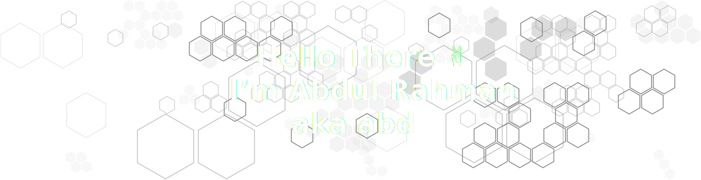
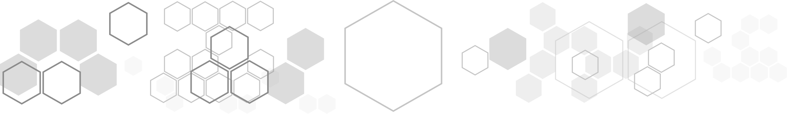

I’m a passionate software developer and tech enthusiast, with a deep focus on Python programming and creative design. My expertise lies in transforming ideas into reality through dynamic web applications and intuitive user interfaces. I’m constantly driven by the challenge of solving problems and exploring new technologies.

---
# `Education & Certifications`

I am currently pursuing a degree at the University of Engineering and Technology (UET), with an expected graduation in 2027. Along the way, I've earned several certifications including,

- Python certificate from Harvard's CS50 program
- 3rd place in the SciTech Competition by COMSATS
- 5th place in the 1st Inter-Colleges Mathematical Contest by COMSATS
- Microsoft Office Specialist certification

---
# `Languages & Tools`

| Category | Tools |
| --- | --- |
| Programming Languages |     |
| Markup  Languages |    |
| Style Sheet Languages |  |
| IDEs |    |
| Version Control |    |
| Frameworks & Libraries |       |
| Deployment & Cloud |     |
| Databases |      |
| APIs & Integrations |      |
| Graphics & Design |        |

---
# `Projects & Repositories`

| Project | Description | Created |
| --- | --- | --- |
| [hianime-to-myanimelist](https://github.com/abdbbdii/hianime-to-myanimelist) | A web app to automate the process of transferring the anime list from HiAnime.to to MyAnimeList.net. | 2024-08-10 |
| [ConsoleUtility](https://github.com/abdbbdii/ConsoleUtility) | This library provides a variety of utilities for working with the console, including ANSI escape sequences for text formatting, cursor movement, and custom text and table formatting. | 2024-07-04 |
| [Google_Classroom_API](https://github.com/abdbbdii/Google_Classroom_API) | This Django project checks for new activities (announcements, coursework, and materials) in Google Classroom courses and sends notifications to a specified webhook URL. | 2024-05-28 |
| [Whatsapp_API](https://github.com/abdbbdii/Whatsapp_API) | This project is a Django-based API system designed to process incoming messages, execute commands via plugins, and interact with a WhatsApp client. It also supports OpenAI's GPT model for generating conversational responses. | 2024-05-27 |
| [DBS-Semester-Project-Source-Control-System](https://github.com/abdbbdii/DBS-Semester-Project-Source-Control-System) | Database project for college. This project is a striped down version of github (only database design). | 2024-05-04 |
| [LMS-Semester-Project](https://github.com/abdbbdii/LMS-Semester-Project) | College Project for Student Management System written in C++ which help schools and educational institutions efficiently manage student-related tasks. | 2024-05-04 |
| [Context-Menu-Plugin-Manager](https://github.com/abdbbdii/Context-Menu-Plugin-Manager) | This software manages context menu plugins to extend functionality in various directories. It allows dynamic addition and removal of context menu items using Python scripts. | 2024-04-02 |
| [prayer-time-tracker](https://github.com/abdbbdii/prayer-time-tracker) | This app provides a GUI interface built with Tkinter to display the prayer times and remaining time until the next prayer. | 2024-04-01 |
| [Markdown-badge-generator](https://github.com/abdbbdii/Markdown-badge-generator) | Web-app to generate a markdown badge for your README.md/Username.md file. | 2023-12-30 |
| [Car-Rental-Management-System](https://github.com/abdbbdii/Car-Rental-Management-System) | This repository contains UET 1st Semester Car Rental Mangement System Project. | 2023-12-19 |
| [Harverd-CS50P-projects](https://github.com/abdbbdii/Harverd-CS50P-projects) | This repository contains mini projects completed as part of the Harvard CS50P. | 2023-12-19 |
| [prize-bond-finder](https://github.com/abdbbdii/prize-bond-finder) | Desktop application designed to streamline the management and tracking of prize bonds. | 2023-12-06 |
| [minecraft-hotkey-map](https://github.com/abdbbdii/minecraft-hotkey-map) | This project is for CS50P final week as well as my first project in python. | 2023-09-16 |

---
# `GitHub Stats`

---
# `Hobbies & Interests`

- 🌟 Anime: Diving into the world of anime, exploring different genres and stories.
- 🎮 Gaming: Engaging in immersive gaming experiences and exploring new titles.
- 🤖 Android Experimentation: Experimenting with Android devices, including rooting and flashing custom ROMs.
- 🎨 Graphic Design: Freelancing in graphic design, creating visual content.
- 💻 Programming: Enhancing my programming skills and staying updated with the latest tech trends.

---
# `My Anime List`

Plan To Watch

| 91 Days | Akame ga Kill! | Boku no Hero Ac...demia | Chuunibyou demo...itai! |
| :---: | :---: | :---: | :---: |
|  |  |  |  |

| Code Geass: Han...louch | Code Geass: Han...orium | Death Parade | Gake no Ue no Ponyo |
| :---: | :---: | :---: | :---: |
|  |  |  |  |

| Haikyuu!! | Hal | Horimiya | Howl no Ugoku Shiro |
| :---: | :---: | :---: | :---: |
|  |  |  |  |

| Kage no Jitsury...u-hen | Kaijuu 8-gou Movie | Kengan Ashura Part 2 | Kimitachi wa Do...ru ka |
| :---: | :---: | :---: | :---: |
|  |  |  |  |

| Kiseijuu: Sei n...ritsu | Kobayashi-san C...ragon | Kono Subarashii...wo! 2 | Kotonoha no Niwa |
| :---: | :---: | :---: | :---: |
|  |  |  |  |

| Ninja Kamui | Omoide no Marnie | Re:Zero kara Ha...Movie | Shikanoko Nokon...antan |
| :---: | :---: | :---: | :---: |
|  |  |  |  |

| Shin no Nakama ...shita | Shinchou Yuusha...ugiru | Tenkuu no Shiro...aputa | Tensei shitara ...a Ken |
| :---: | :---: | :---: | :---: |
|  |  |  |  |

| Tonari no Kaibu...u-kun | Umi ga Kikoeru |
| :---: | :---: |
|  |  |

Completed

| Ano Hi Mita Han...Movie | Ansatsu Kyoushitsu | Ansatsu Kyoushi...eason | Bleach Movie 3:... Yobu |
| :---: | :---: | :---: | :---: |
|  |  |  |  |

| Boku no Kokoro ...Yatsu | Byousoku 5 Cent...meter | Chainsaw Man | Dark Gathering |
| :---: | :---: | :---: | :---: |
|  |  |  |  |

| Death Note: Rewrite | Dororo | Dr. Stone: New ...art 2 | Dr. Stone: Ryuusui |
| :---: | :---: | :---: | :---: |
|  |  |  |  |

| Dr. Stone: Ston... Wars | Jujutsu Kaisen | Jujutsu Kaisen ...Movie | Jujutsu Kaisen ...eason |
| :---: | :---: | :---: | :---: |
|  |  |  |  |

| Kimetsu no Yaiba | Kimetsu no Yaib...a-hen | Kimetsu no Yaib...o-hen | Kimetsu no Yaib...o-hen |
| :---: | :---: | :---: | :---: |
|  |  |  |  |

| Kimetsu no Yaib...u-hen | Kimi no Suizou ...betai | Koe no Katachi | Mushoku Tensei:... Dasu |
| :---: | :---: | :---: | :---: |
|  |  |  |  |

| Nakitai Watashi...aburu | Nichijou | One Punch Man 2...eason | One Punch Man 2...cials |
| :---: | :---: | :---: | :---: |
|  |  |  |  |

| One Punch Man S...cials | Ore dake Level ...a Ken | Owari no Seraph | Owari no Seraph...n-hen |
| :---: | :---: | :---: | :---: |
|  |  |  |  |

| Re:Zero kara Ha...katsu | Shigatsu wa Kim...o Uso | Shingeki no Kyojin | Shingeki no Kyo...son 2 |
| :---: | :---: | :---: | :---: |
|  |  |  |  |

| Shingeki no Kyo...son 3 | Shingeki no Kyo...eason | Shingeki no Kyo...art 2 | Sword Art Onlin...nline |
| :---: | :---: | :---: | :---: |
|  |  |  |  |

| Sword Art Online II | Sword Art Onlin...ation | Sword Art Onlin...world | Sword Art Onlin...eason |
| :---: | :---: | :---: | :---: |
|  |  |  |  |

| Tenki no Ko | Tokyo Ghoul:re | Tokyo Ghoul:re ...eason | Tokyo Revengers |
| :---: | :---: | :---: | :---: |
|  |  |  |  |

| Tokyo Revengers...n-hen | Tomodachi Game | Violet Evergard...ngyou | Violet Evergard...Movie |
| :---: | :---: | :---: | :---: |
|  |  |  |  |

| Violet Evergard...Darou | Wind Breaker | Yakusoku no Nev...rland | Youkoso Jitsury...tsu e |
| :---: | :---: | :---: | :---: |
|  |  |  |  |

| Youkoso Jitsury...eason |
| :---: |
|  |

Watching

| Ao no Exorcist | Fruits Basket 1...eason | Kaguya-sama wa ...ousen | Kaguya-sama wa ...ousen |
| :---: | :---: | :---: | :---: |
|  |  |  |  |

| Steins;Gate 0 |
| :---: |
|  |

Dropped

| Cyberpunk: Edge...nners | Elfen Lied | Sousou no Frieren | Tekken: Bloodline |
| :---: | :---: | :---: | :---: |
|  |  |  |  |

| Trigun Stampede | Tsuki ga Michib...uchuu |
| :---: | :---: |
|  |  |

On Hold

| Kiniro Mosaic | Kusuriya no Hit...igoto | Tokyo Revengers...u-hen |
| :---: | :---: | :---: |
|  |  |  |

---
# `Meet my Code Buddies!`

| abeehimr |
| :---: |
|  |
| [@Abeehimr](https://github.com/Abeehimr) |

---
# `Support Me`

Help me keep my work open source and free for everyone. Show your appreciation by buying me a coffee ☕️

