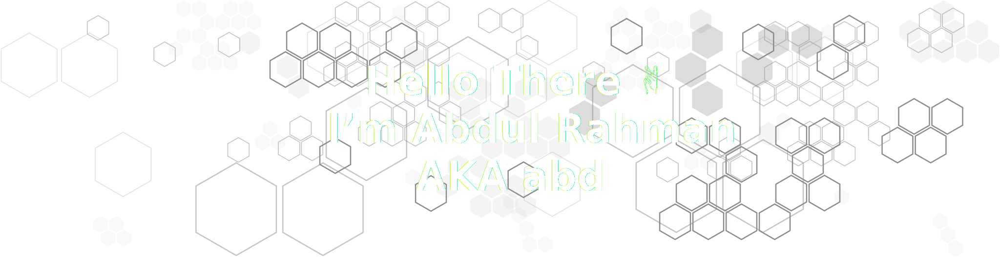

<!-- 

<br>

<center>

# `Hi There 👋`

</center>

<br><br><br> -->




```python
name = "Abdul Rahman"
print(f'Name: {name}', f'shortName: {name[0:3].lower()}', sep='\n')
```

```bash
$ curl -sSL https://raw.githubusercontent.com/abdbbdii/abdbbdii/main/README.md | sed -n '4,5p' | python3
Abdul Rahman
abd
abdbbdii
```

```python
languages = [
    "Python",
    "C/C++",
    "HTML",
    "CSS",
]
ideOfChoice = "VS Code"
games = [
    "Minecraft",
    None,
]
learning = True
earning = False
```

### My stats


### Meet my code buddy!


|                                   Ibraheem Qureshi                                    |
| :-----------------------------------------------------------------------------------: |
| [](https://github.com/Abeehimr) |
|                       [@Abeehimr](https://github.com/Abeehimr)                        |

---

<!-- [](https://www.buymeacoffee.com/abdbbdii) -->

[](https://www.buymeacoffee.com/abdbbdii)
